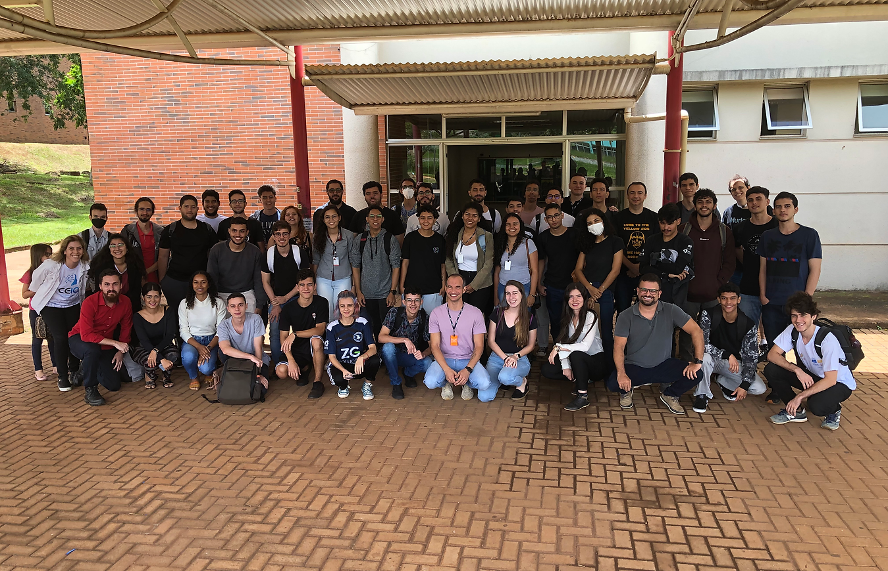

# Programa de Capacitação 4.0 CEIA/EMBRAPII (Turma I)

Link de acesso ao site do [programa k](https://www.programak.info/).

O Programa Capacitação do CEIA é formado por um conjunto de projetos que visam desenvolver os conhecimentos (qualidade de saber), as habilidades (qualidade de fazer) e as atitudes (qualidade de comportar-se) dos participantes.

Participar do Programa de Capacitação do CEIA envolve a realização de atividades práticas (hands-on), nas quais os participantes têm a oportunidade de aplicar diretamente seus conhecimentos, aprimorar suas habilidades e adotar as atitudes necessárias. Essas atividades são avaliadas com base na execução e nas entregas realizadas, promovendo uma abordagem de aprendizado altamente envolvente e orientada para resultados.

  

<em>Legenda: <i>primeira turma</i></em>

**Observação:**  
`Este repositório tem como objetivo servir como espaço para armazenar backups das páginas em HTML que foram desenvolvidas durante minha participação no programa k.
 Também é uma forma de ver meu progresso utilizando HTML e CSS`
